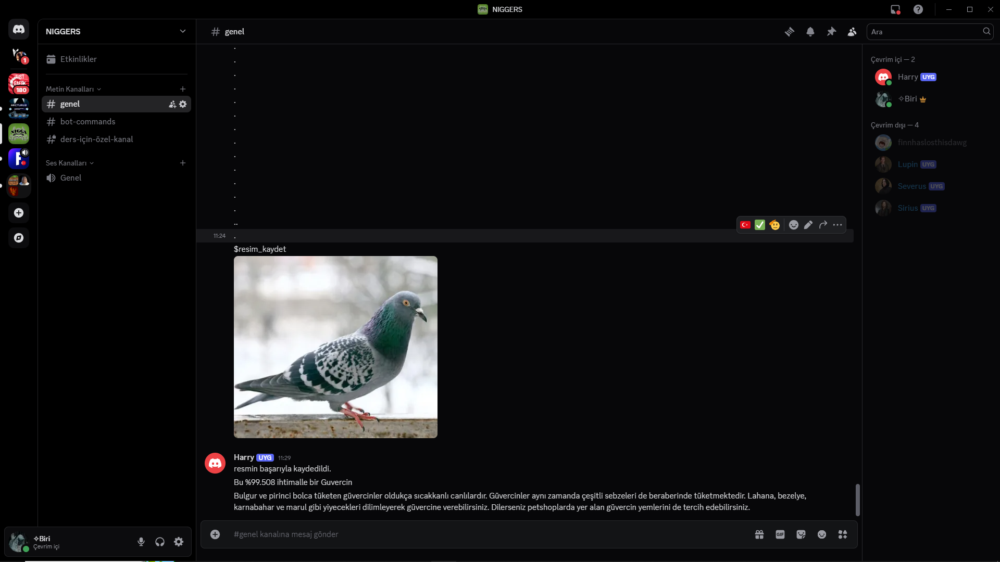

# Görüntü Sınıflandırma Botu

Bu proje, eğitimli bir makine öğrenimi modeli kullanarak görselleri otomatik olarak sınıflandıran bir bot içerir. Görselleri belirli kategorilere ayırmak için geliştirilmiş bir sinir ağı modeli kullanılmıştır. Proje Python dilinde geliştirilmiş olup açık-kaynak olarak paylaşılmıştır.

## 🚀 Özellikler

- Görsel dosyalarını otomatik olarak sınıflandırır.
- Eğitimli model dosyasıyla çalışır (örneğin: `model.h5`, `model.pt` vb.).
- Basit arayüzü sayesinde kullanıcı dostudur.
- CLI veya web tabanlı kullanılabilirlik (Flask, Streamlit vs. ile entegre edilebilir).
- Yeni verilerle yeniden eğitilebilir.

## 🧠 Nasıl Çalışır?

1. Kullanıcı bir görsel yükler.
2. Görsel ön işleme tabi tutulur (yeniden boyutlandırma, normalleştirme vb.).
3. Eğitimli model bu görseli analiz eder ve tahmin edilen sınıfı döner.
4. Sonuç kullanıcıya sunulur.

> Model, `Keras`, `TensorFlow` veya `PyTorch` gibi popüler kütüphanelerle eğitilmiş olabilir.

## 📸 Ekran Görüntüleri

### Ana Arayüz:


### Tahmin Sonucu:


## ⚙️ Kurulum

```bash
git clone https://github.com/kullanici-adi/proje-adi.git
cd proje-adi
pip install -r requirements.txt
python app.py
